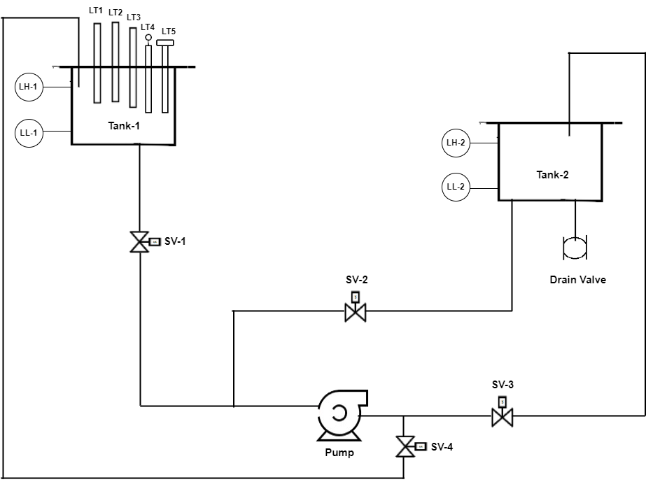

##Theory

#### Level measurement: 

In industry, liquids such as water, chemicals, and solvents are used in various processes. The amount of such liquid stored can be found by measuring level
 of the liquid in a container or vessel. The level affects not only the quantity delivered but also pressure and rate of flow in and out of the container. 

Level sensors detect the level of substances like liquids, slurries, granular materials, and powders. The substance to be measured can be inside a container 
or can be in its natural form (e.g. a river or a lake).

#### The selection criteria for level sensor include: 

-	The physical phase (liquid, solid or slurry) 
-	Temperature 
-	Pressure or vacuum 
-	Chemistry 
-	Density (specific gravity) of medium 
-	Agitation (action) 
-	Acoustical or electrical noise 
-	Vibration 
-	Mechanical shock 
-	Tank or bin size and shape 
	
#### From the application point of view the considerations are: 

-	Accuracy 
-	Response time 
-	Ease of calibration 
-	Physical size and mounting of the instrument 
-	Monitoring or control of continuous or discrete levels 
-	Price 

	
#### Level measurements are broadly classified in two groups: 

-	Direct methods 
-	Indirect methods 

In direct methods, the level is indicated directly by means of simple mechanical devices. The measurement is not affected by changes in material density.
 Few examples are: 

-	Dip Stick 
-	Resistance Tapes 
-	Sight Glass 
-	Floats 
-	Ultrasonic 
-	Radar 

#### In Indirect methods, 
the level is converted in a measurable signal using a suitable transducer. Change in the material affects the measurement. A corrective factor must be used 
in recalibrating the instrument. Few examples are : 

-	Hydrostatic head methods 
-	Load cell 
-	Capacitance 
-	Conductivity 

#### Capacitance Level Measurement : 

Capacitance level sensors are used for wide variety of solids, aqueous and organic liquids, and slurries. The technique is frequently referred as RF as
 radio frequency signals applied to the capacitance circuit.

#### Working Principle : 

The principle of capacitive level measurement is based on change of capacitance. An insulated electrode acts as one plate of capacitor and the tank wall 
(or reference electrode in a non-metallic vessel) acts as the other plate. The capacitance depends on the fluid level. An empty tank has a lower capacitance
while a filled tank has a higher capacitance.
A simple capacitor consists of two electrode plate separated by a small thickness of an insulator such as solid, liquid, gas, or vacuum. This insulator is
also called as dielectric. 
Value of C depends on dielectric used, area of the plate and also distance between the plates.
#### C = ε (K A/d)
Where : 
C = capacitance in Pico farads (pF) 
K = relative dielectric constant of the insulating material 
A = effective area of the conductors 
d = distance between the conductors 
ε = a constant known as the permittivity.

This change in capacitance can be measured using AC Bridge.

#### Measurement : 

Measurement is made by applying an RF signal between the conductive probe and the vessel wall. The RF signal results in a very low current flow through
 the dielectric process material in the tank from the probe to the vessel wall. When the level in the tank drops, the dielectric constant drops causing 
 a drop in the capacitance reading and a minute drop in current flow. 

This change is detected by the level switch's internal circuitry and translated into a change in the relay state of the level switch in case of point
 level detection. In the case of continuous level detectors, the output is not a relay state, but a scaled analog signal.

#### Ultrasonic Level Measurement: 

Ultrasonic level sensors are used for highly viscous liquids, as well as bulk solids and in water treatment applications for pump control and open
 channel flow measurement. The sensors emit high frequency (20 kHz to 200 kHz) acoustic waves that are reflected back to and detected by the emitting
 transducer.

#### Working Principle: 
Ultrasonic sensors emit one or multiple pulses of ultrasonic energy, which travel through the air at the speed of sound. A portion of this energy
 reflects off the target and travels back to the sensor. The sensor measures the total time required for the energy to reach the target and return 
 to the sensor. The distance to the object is then calculated utilizing the equation:

#### D = ct / 2

D = distance from the sensor to the target 
c = speed of sound in air 
t = transit time for the ultrasonic pulse 
To improve accuracy, an ultrasonic sensor may average the results of several pulses before outputting a new value.

#### Measurement: 

Ultrasonic pulse signal is targeted towards an object, it is reflected by the object and echo returns to the sender. The time travelled by the ultrasonic
 pulse is calculated, and the distance of the object is found. Bats use well known method to measure the distance while travelling.

#### Pulse Radar type Level Measurement : 
Pulse radar type level sensors are used for all applications including foaming, fuming, heavy vapours/dust, pressurized tank, etc with wide range of antenna.
 The microwave signal is generated and transmitted via antenna. 

#### Working principle:

Microwave signal is emitted via an antenna and reflected on the measuring surface and receive with a time delay. The distance to the object is then calculated
 utilizing the equation:

#### D= C t / 2 
D = distance from the sensor to the target 
c = speed of sound in air 
t = transit time for the microwave pulse

#### Measurement: 

The antenna system of the radar sensor sends out extremely short microwave pulses that are reflected by the product surface and received back by the antenna
 system. The time elapsing from emission to reception of the microwave pulses is proportional to the level in the container.

#### Guided wave radar type level measurement : 

In this type of radar level measurement, microwave pulses are conducted along a cable or rod probe and reflected by the product surface. The measuring probe 
of the sensor ensures that the signal reaches the medium undisturbed. 
The advantages of this sensor are that sensors measure reliably even with: 

-	Steam generation 
-	Pressure and temperature fluctuations 
-	Dust and noise 
-	Condensation 

#### Working principle: 

High frequency microwave pulses are coupled on a cable or rod and guided along the probe. The pulse is reflected by the product surface and received by the
processing electronics. This electronics evaluates the echo signal and converts it into a level information. All instruments are preset to the ordered probe
length.

#### Magnetostrictive type Level Measurement : 

It is based on the principle of Magnetostriction, has potentially very high measurement resolution, typically better than 0.001 inch.

A sensor wire is connected to a piezoceramic sensor at the transmitter and a tension fixture is attached to the opposite end of the sensor tube.
 The tube either runs through a hole in the centre of the float or is adjacent to the float outside of a nonmagnetic float chamber. To locate the float,
 the transmitter sends a short current pulse down the sensor wire, setting up a magnetic field along its entire length. Simultaneously, a timing circuit
 is triggered ON. The field interacts immediately with the field generated by the magnets in the float. The overall effect is that during the brief time
 the current flows, a torsional force is produced in the wire, much like an ultrasonic vibration or wave.

This force travels back to the piezoceramic sensor at a characteristic speed. When the sensor detects the torsional wave, it produces an electrical signal
 that notifies the timing circuit that the wave has arrived and stops the timing circuit. The timing circuit measures the time interval (TOF) between the
 start of the current pulse and the wave's arrival and The distance to the object is then calculated utilizing the equation : 
 D= C t / 2 

#### Level Sensor P & ID

In the above P&ID diagram, there are two tanks lower and upper tank. Lower tank is used as source and it must be filled with the water. On the upper tank,
five sensors(named as 1,2,3,4,5) are mounted which are used for the level measurement of the water and both the tank have two magnetic level switches each
that is LL1,LH1 for upper tank where as for lower tank LL2 and LH2. LL1 and LL2 indicate lower level of water and LH1 and LH2 indicate Higher level of water.

In this, four angle sealed solenoid valves (V1, V2, V3, V4) are used to control the flow of water. As the lower tank is the source of the liquid so the
water will be pump from lower tank to upper tank by using the motor (M) which is controlled by VFD through PLC when valve (V2 and V4) are in switch on
condition. Similarly liquid is drained from higher to lower tank when valve (V1 and V3) are on.

#### Level Sensor Plant

#### Ultrasonic level transmitter 

#### Capacitive level transmitter

#### Magnetostrictive  level transmitter

#### Pulse Radar level transmitter

#### Guided Radar level transmitter

	

	

